# Eval `baseline`

2026-09-24T08:15:58 · commit `ea80267` · models.yaml `919e01fa` · 1 runs, 14 slides

| metric | value |
|---|---|
| runs_passed | 1 |
| runs_errored | 0 |
| slide_count_off | 0 |
| compiled_pct | 85.7 |
| first_pass_pct | 50.0 |
| mean_retries | 0.57 |
| cards | 46 |
| mean_fill | 0.884 |
| low_fill_pct | 13.0 |
| word_breaks_per_slide | 0.0 |
| text_overflows_per_slide | 0.21 |
| invented_numbers | 15 |
| auto_fixes_per_slide | 0.14 |
| layout_issues_per_slide | 0.79 |
| fit_grow_changes_per_slide | 0.86 |
| tokens_in | 345452 |
| tokens_out | 59169 |
| cost_usd | 1.1643 |
| elapsed_s | 395.1 |

Fill = card content height ÷ inner height (1.0 = no dead space); low fill < 0.7. Word breaks = text boxes narrower than their longest word; text overflows = text needing 2+ lines more than its box; invented numbers = numbers on slides that are not in the brief; slide_count_off = runs whose slide count differs from the case target.

## Cases

| case | run | pass | slides (target) | first-pass | retries | mean fill | low-fill cards | word breaks | overflows | invented numbers | layout issues | golden match |
|---|---|---|---|---|---|---|---|---|---|---|---|---|
| gj-h1-regen | 1 | PASS | 14 (14) | 7/14 | 8 | 0.88 | 6 | 0 | 3 | 15 | 11 | 0.38 |

## Auto-fix codes (first attempt)

- `ZERO_SPACING`: 1
- `BORDER_ACCENT_FIX`: 1

## Blocking codes during retries

- `PARSE_ERROR`: 23
- `INVALID_VALUE`: 5
- `RENDER_ERROR`: 1

## Blocking messages (first 3 per slide)

- `PARSE_ERROR: <VStack>: Attribute "shadow" conflicts with dot-notation attributes (e.g., "shadow.xxx"). Use one or the other, not both`: 6
- `PARSE_ERROR: <Table>: Missing required attribute "rows"`: 1
- `INVALID_VALUE: <VStack>: border.width: Cannot convert "0 0 0 5" to number`: 1
- `PARSE_ERROR: <Text>: Missing required attribute "text"`: 1
- `RENDER_ERROR: addTable: each row must contain one cell per grid column`: 1

## Layout-audit codes (final attempt)

- `MISSING_DIMS`: 7
- `XML_PARSE_ERROR`: 4

## Card patterns

- `text_card`: 19
- `kpi_tile`: 12
- `table_card`: 8
- `chart_card`: 4
- `dark_panel`: 3

## Planner component kinds

- `title`: 13
- `narrative`: 11
- `table`: 10
- `kpi_row`: 8
- `bullet_list`: 7
- `chart`: 5
- `timeline`: 2
- `process_arrow`: 1

## Lowest-fill slides

- gj-h1-regen run 1 slide 9: min fill 0.486
- gj-h1-regen run 1 slide 0: min fill 0.622
- gj-h1-regen run 1 slide 7: min fill 0.622
- gj-h1-regen run 1 slide 6: min fill 0.681
- gj-h1-regen run 1 slide 3: min fill 0.688
- gj-h1-regen run 1 slide 8: min fill 0.688
- gj-h1-regen run 1 slide 2: min fill 0.72
- gj-h1-regen run 1 slide 12: min fill 0.766
- gj-h1-regen run 1 slide 13: min fill 0.771
- gj-h1-regen run 1 slide 1: min fill 0.802

## Review renders

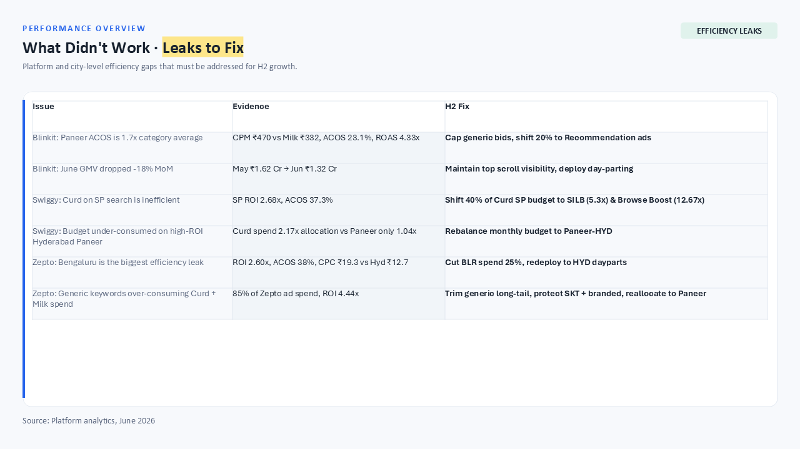

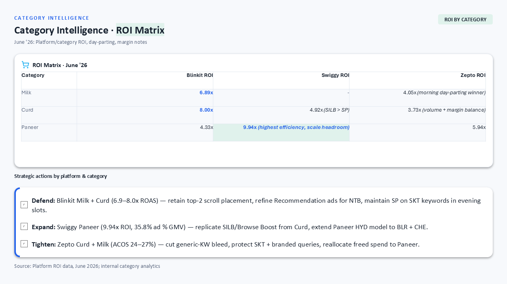
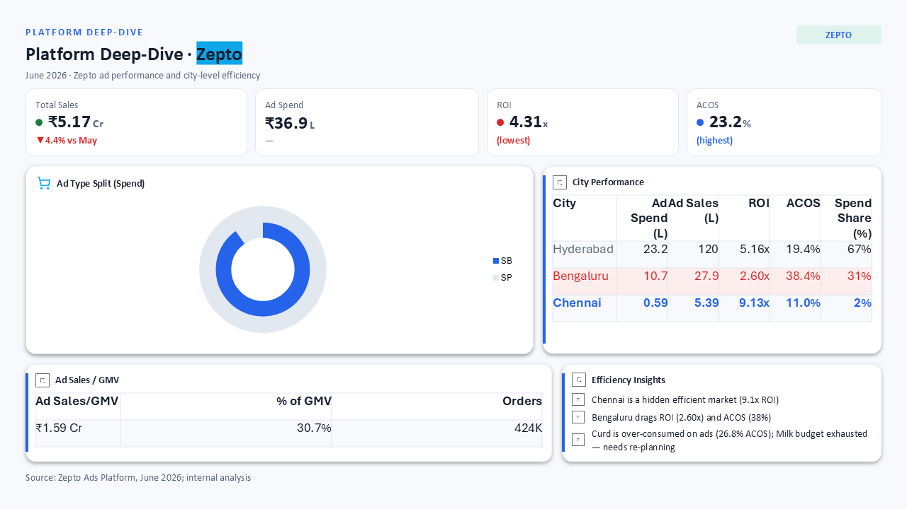
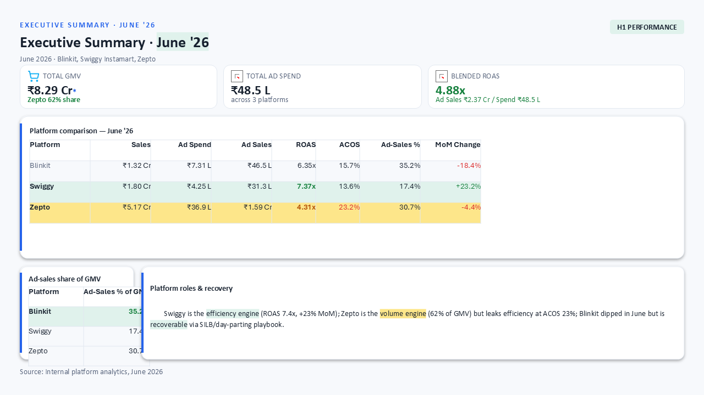
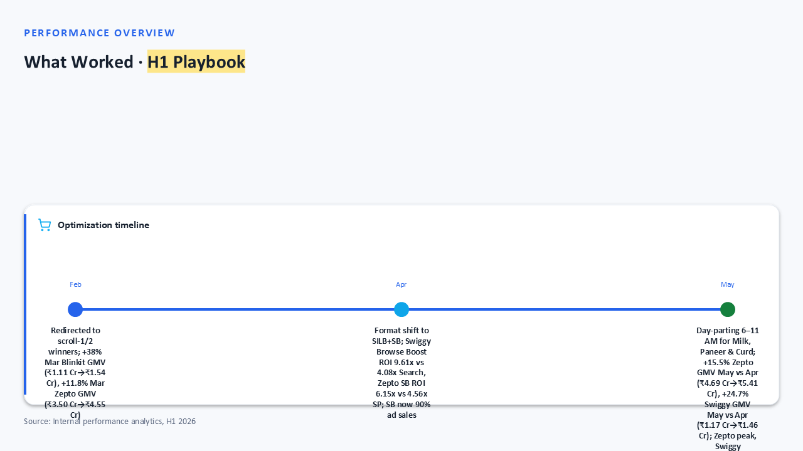
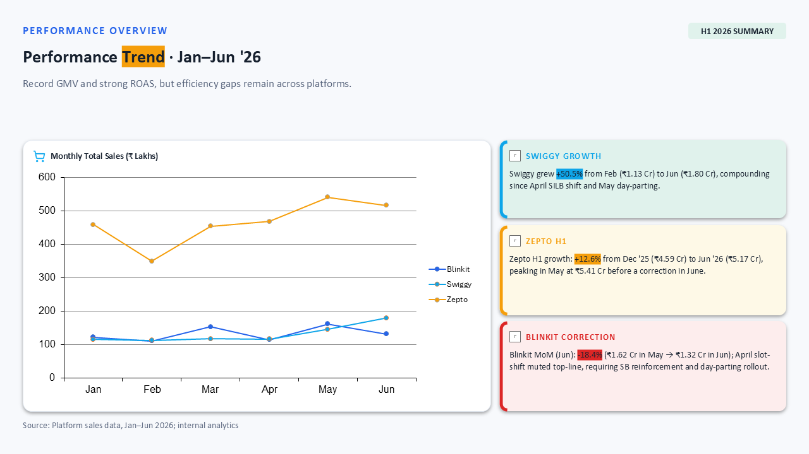
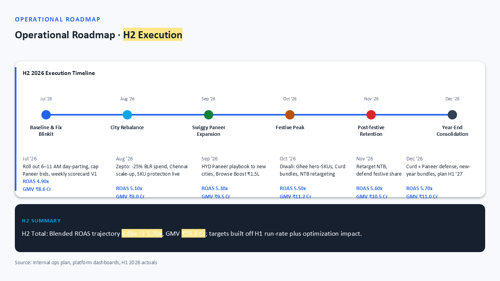
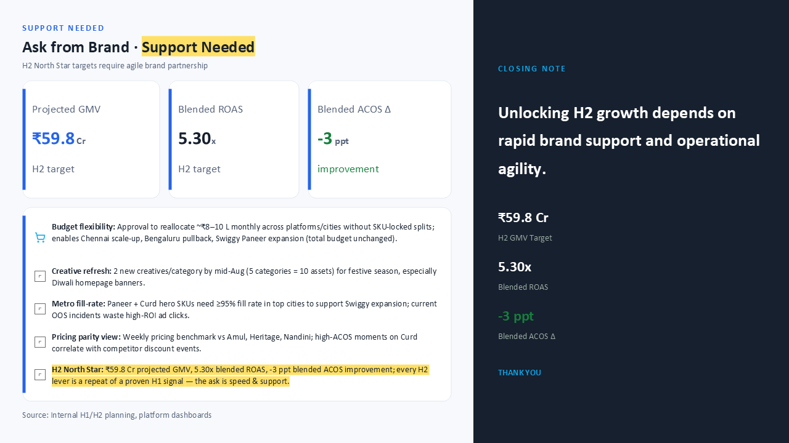
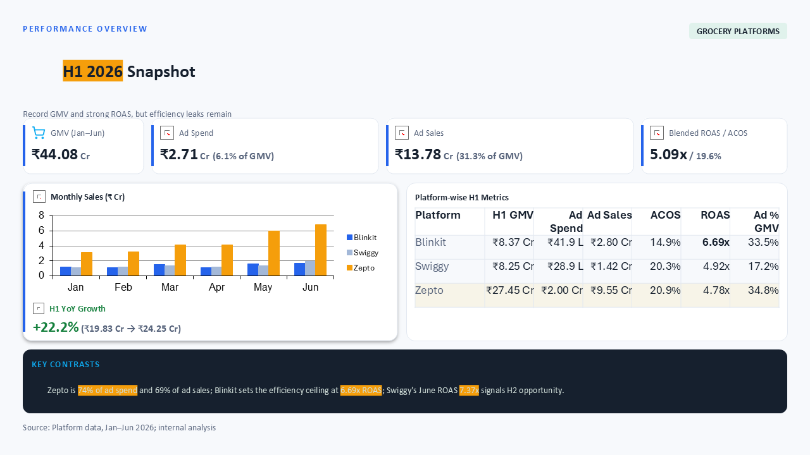
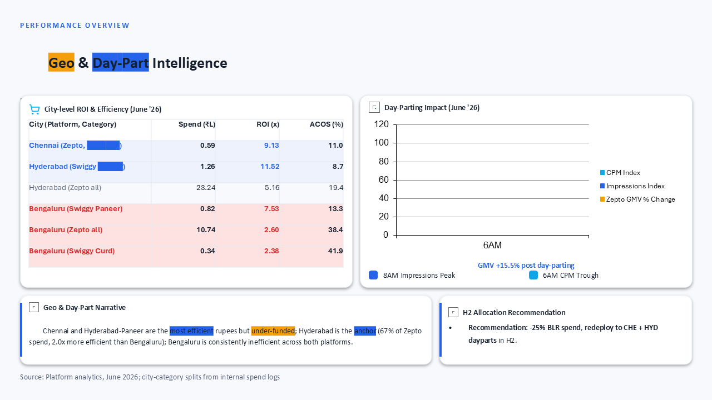
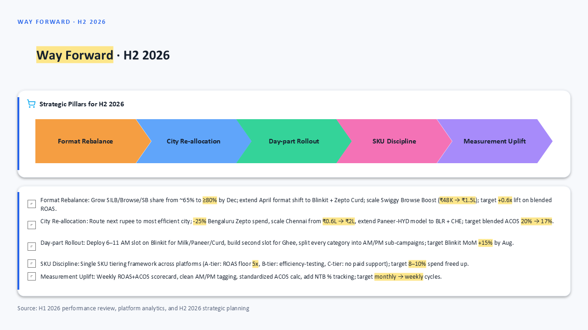
