# Eval `golden-gj-h1`

2026-09-23T23:14:15 · commit `0c7807b` · models.yaml `1f984f77` · 1 runs, 14 slides

| metric | value |
|---|---|
| runs_passed | 1 |
| runs_errored | 0 |
| compiled_pct | 100.0 |
| first_pass_pct | 100.0 |
| mean_retries | 0.0 |
| cards | 74 |
| mean_fill | 0.866 |
| low_fill_pct | 14.9 |
| auto_fixes_per_slide | 0.0 |
| layout_issues_per_slide | 39.93 |
| fit_grow_changes_per_slide | 1.29 |
| tokens_in | 0 |
| tokens_out | 0 |
| cost_usd | 0.0 |
| elapsed_s | 0.0 |

Fill = card content height ÷ inner height (1.0 = no dead space); low fill < 0.7.

## Cases

| case | run | pass | slides | first-pass | retries | mean fill | low-fill cards | layout issues | golden match |
|---|---|---|---|---|---|---|---|---|---|
| gj-h1-deck | 1 | PASS | 14 | 14/14 | 0 | 0.87 | 11 | 559 | - |

## Auto-fix codes (first attempt)

- none

## Blocking codes during retries

- none

## Layout-audit codes (final attempt)

- `FONT_TOO_SMALL`: 534
- `MISSING_DIMS`: 14
- `COL_WIDTH_SUM`: 11

## Card patterns

- `kpi_tile`: 36
- `text_card`: 13
- `table_card`: 13
- `dark_panel`: 6
- `chart_card`: 6

## Planner component kinds

- none

## Lowest-fill slides

- gj-h1-deck run 1 slide 1: min fill 0.314
- gj-h1-deck run 1 slide 3: min fill 0.442
- gj-h1-deck run 1 slide 9: min fill 0.466
- gj-h1-deck run 1 slide 12: min fill 0.532
- gj-h1-deck run 1 slide 13: min fill 0.622
- gj-h1-deck run 1 slide 0: min fill 0.635
- gj-h1-deck run 1 slide 7: min fill 0.656
- gj-h1-deck run 1 slide 11: min fill 0.687
- gj-h1-deck run 1 slide 8: min fill 0.768
- gj-h1-deck run 1 slide 5: min fill 0.771

## Review renders

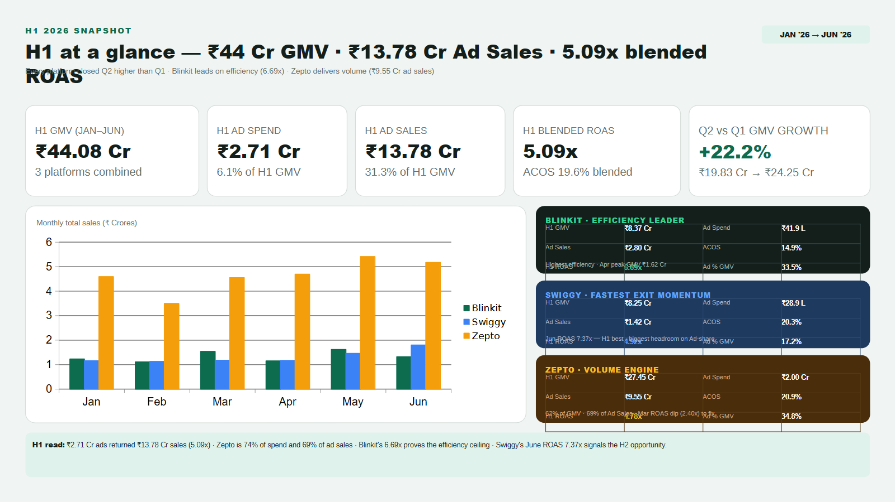
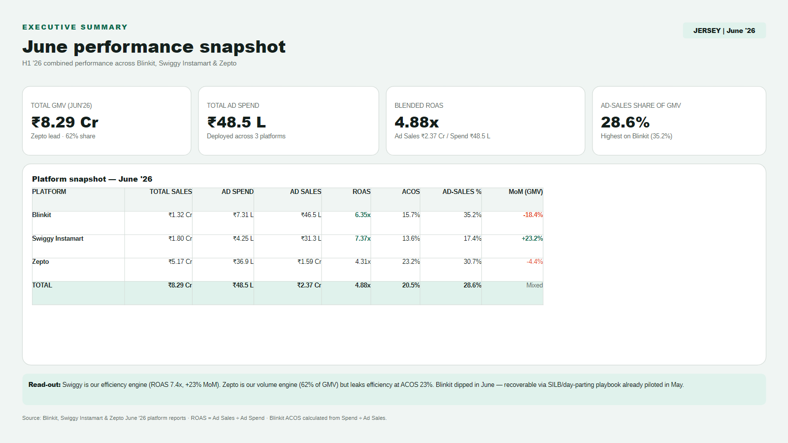
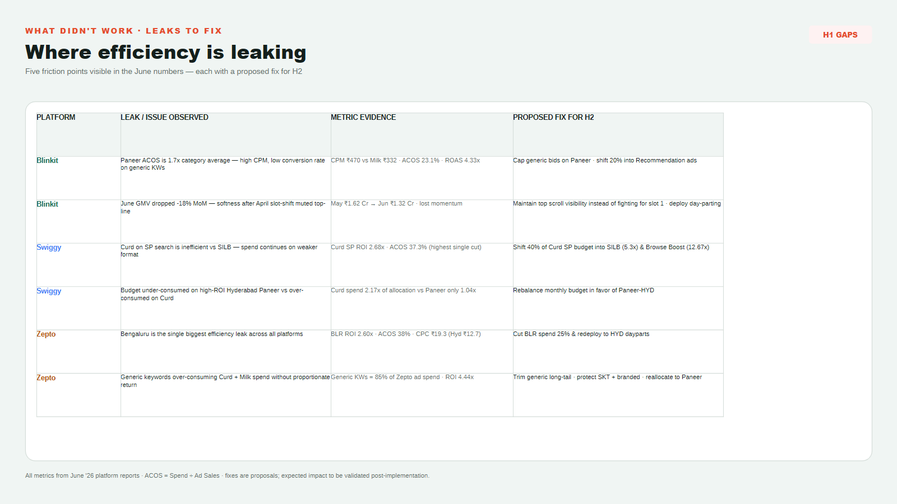
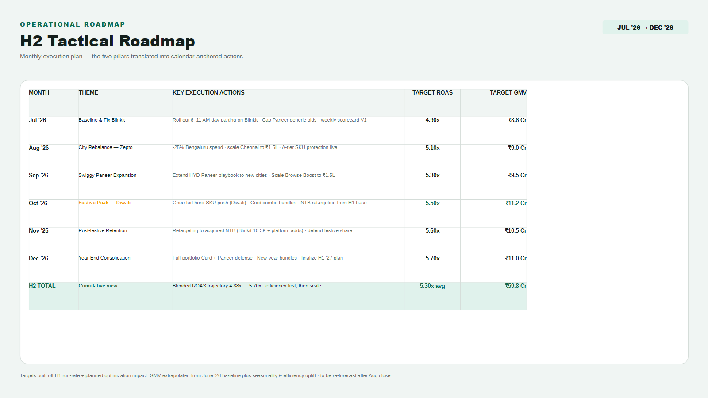
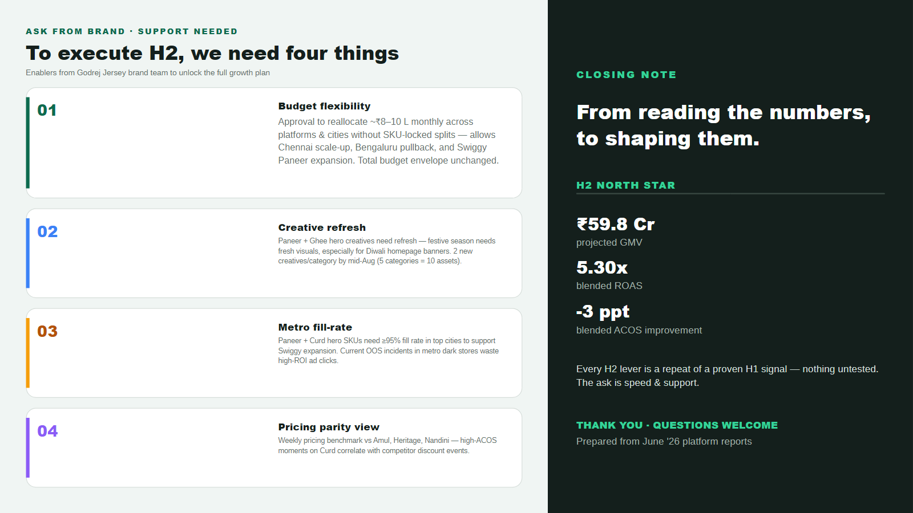
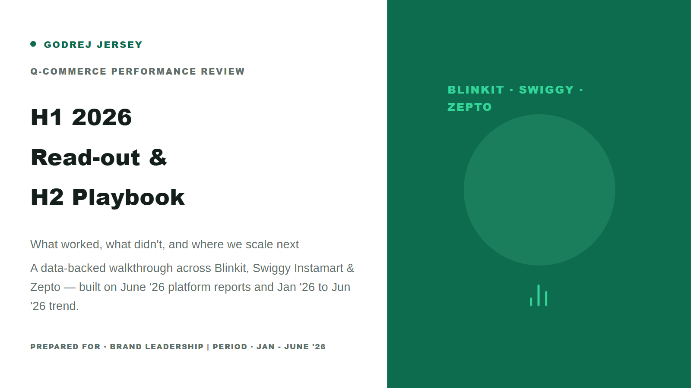
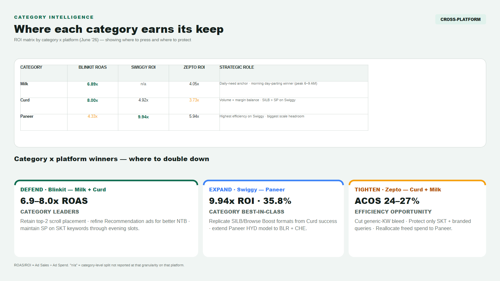
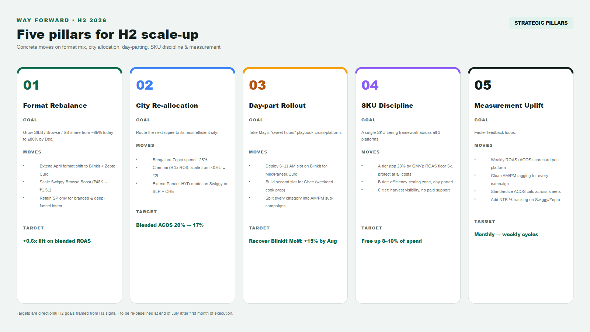
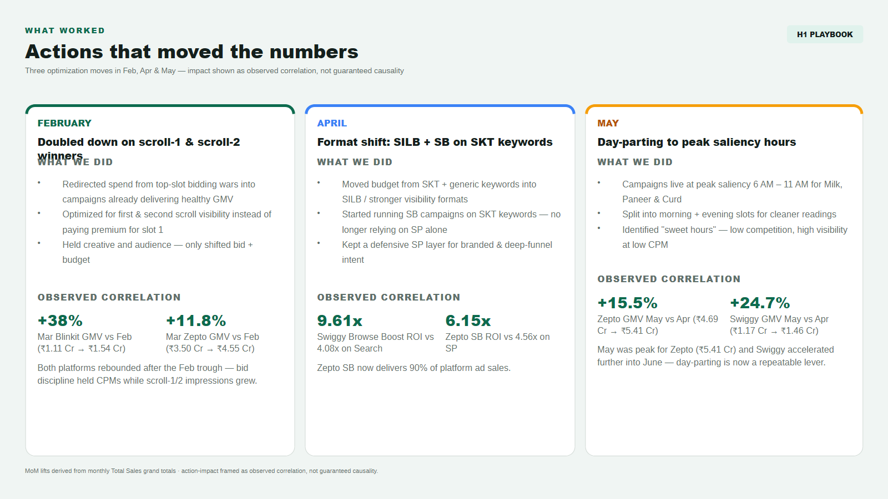
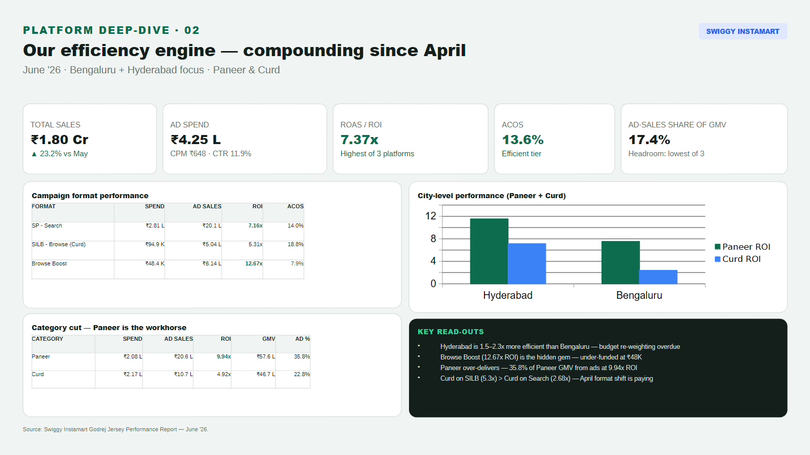
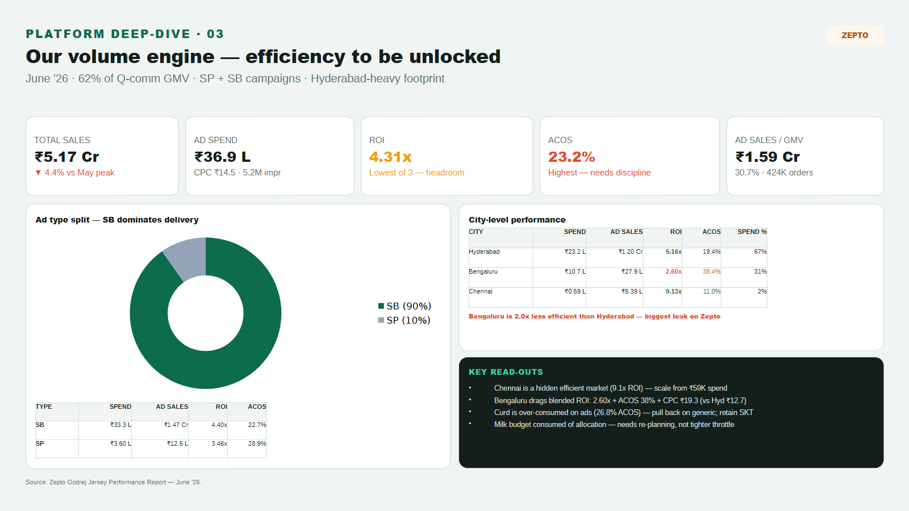
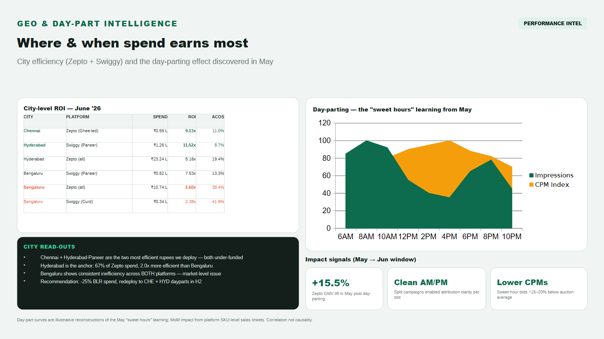
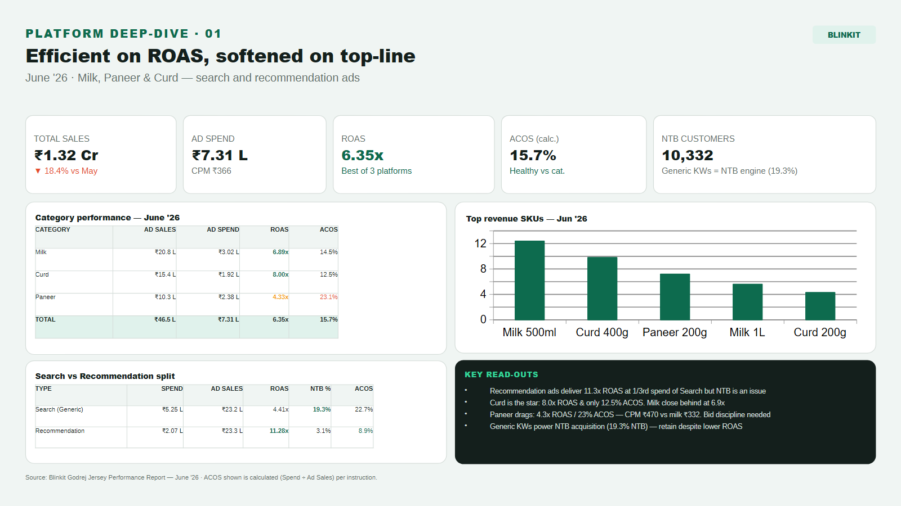
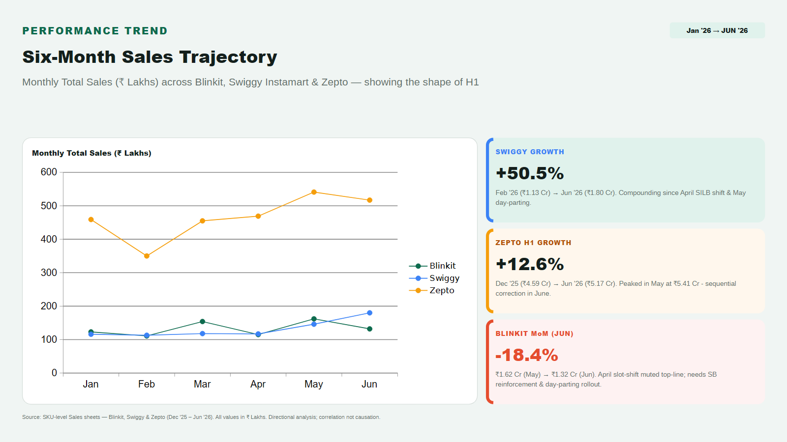
