# Eval `phase-1`

2026-09-24T10:12:00 · commit `4ab1fc2` · models.yaml `919e01fa` · 1 runs, 14 slides

| metric | value |
|---|---|
| runs_passed | 1 |
| runs_errored | 0 |
| slide_count_off | 0 |
| compiled_pct | 100.0 |
| first_pass_pct | 92.9 |
| mean_retries | 0.14 |
| cards | 64 |
| mean_fill | 0.891 |
| low_fill_pct | 10.9 |
| word_breaks_per_slide | 0.07 |
| text_overflows_per_slide | 0.0 |
| invented_numbers | 0 |
| auto_fixes_per_slide | 0.71 |
| layout_issues_per_slide | 0.0 |
| fit_grow_changes_per_slide | 0.29 |
| tokens_in | 324928 |
| tokens_out | 49707 |
| cost_usd | 1.0475 |
| elapsed_s | 328.9 |

Fill = card content height ÷ inner height (1.0 = no dead space); low fill < 0.7. Word breaks = text boxes narrower than their longest word; text overflows = text needing 2+ lines more than its box; invented numbers = numbers on slides that are not in the brief; slide_count_off = runs whose slide count differs from the case target.

## Cases

| case | run | pass | slides (target) | first-pass | retries | mean fill | low-fill cards | word breaks | overflows | invented numbers | layout issues | golden match |
|---|---|---|---|---|---|---|---|---|---|---|---|---|
| gj-h1-regen | 1 | PASS | 14 (14) | 13/14 | 2 | 0.89 | 7 | 1 | 0 | 0 | 0 | 0.475 |

## Auto-fix codes (first attempt)

- `AMPERSAND_ESCAPED`: 5
- `EMPTY_TEXT_REMOVED`: 3
- `BORDER_ACCENT_FIX`: 1
- `ZERO_SPACING`: 1

## Blocking codes during retries

- `UNKNOWN_ATTRIBUTE`: 1
- `INVALID_VALUE`: 1

## Blocking messages (first 3 per slide)

- `UNKNOWN_ATTRIBUTE: <Tr>.<Td>: Unknown attribute "borderLeft"`: 1
- `INVALID_VALUE: addTextBox: height must be a finite positive EMU value`: 1

## Layout-audit codes (final attempt)

- none

## Card patterns

- `text_card`: 24
- `kpi_tile`: 24
- `table_card`: 12
- `chart_card`: 3
- `dark_panel`: 1

## Planner component kinds

- `title`: 13
- `table`: 12
- `narrative`: 11
- `bullet_list`: 8
- `kpi_row`: 5
- `chart`: 3
- `timeline`: 2

## Lowest-fill slides

- gj-h1-regen run 1 slide 4: min fill 0.459
- gj-h1-regen run 1 slide 11: min fill 0.487
- gj-h1-regen run 1 slide 9: min fill 0.547
- gj-h1-regen run 1 slide 0: min fill 0.576
- gj-h1-regen run 1 slide 13: min fill 0.598
- gj-h1-regen run 1 slide 6: min fill 0.656
- gj-h1-regen run 1 slide 10: min fill 0.719
- gj-h1-regen run 1 slide 8: min fill 0.754
- gj-h1-regen run 1 slide 1: min fill 0.768
- gj-h1-regen run 1 slide 7: min fill 0.802

## Review renders

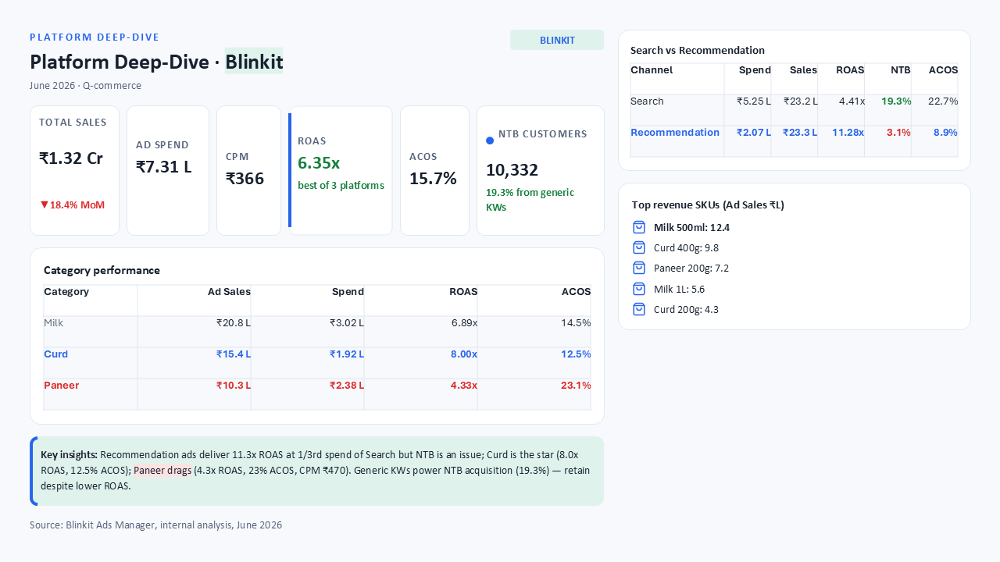
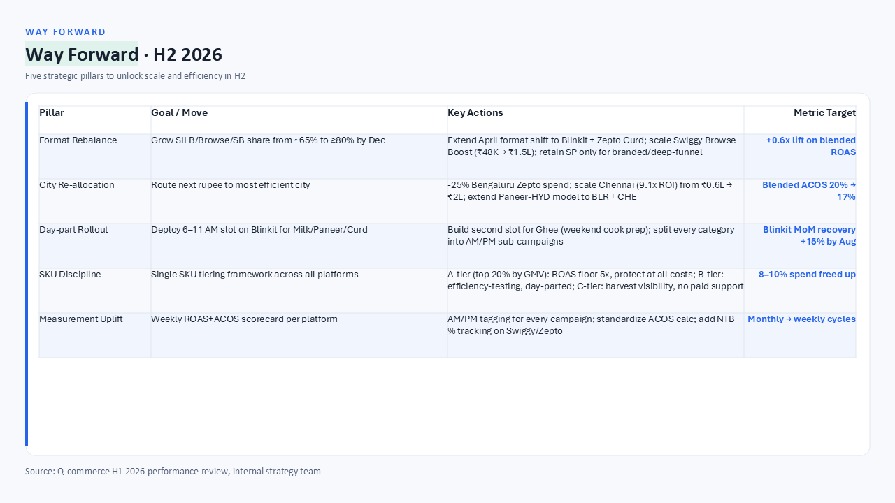
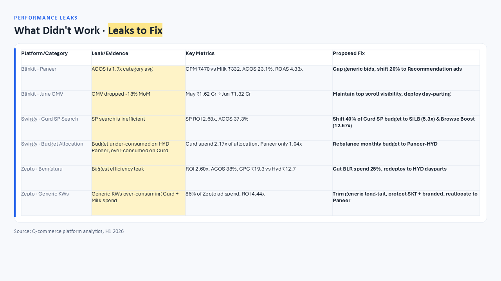

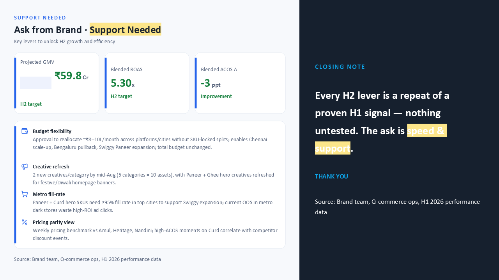
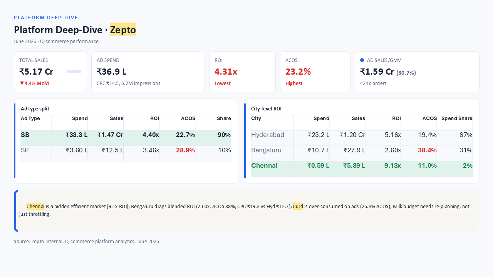
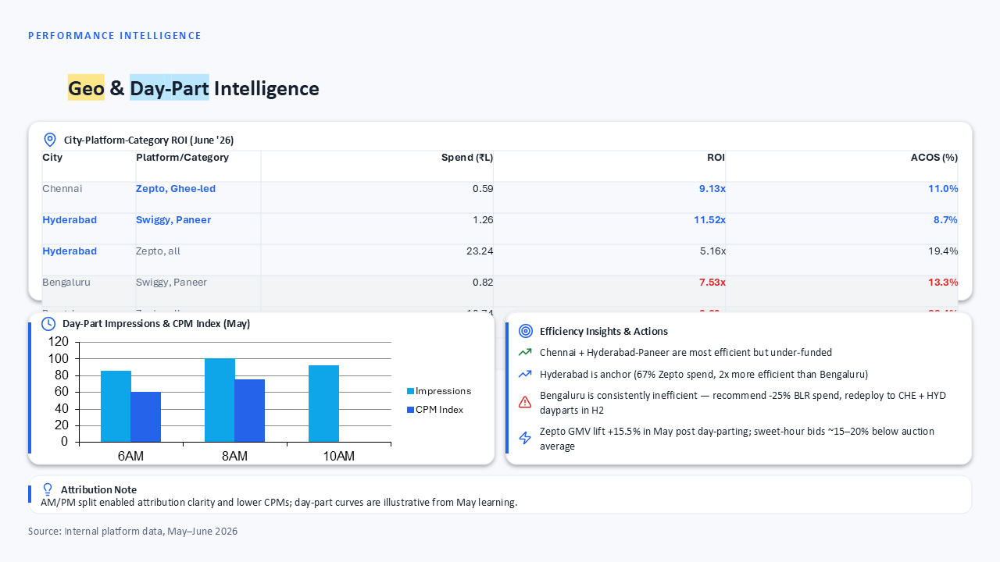
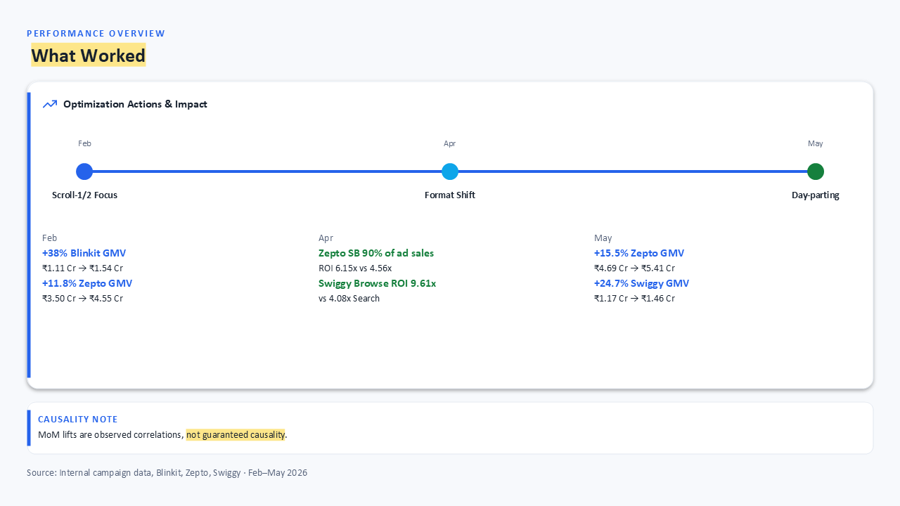
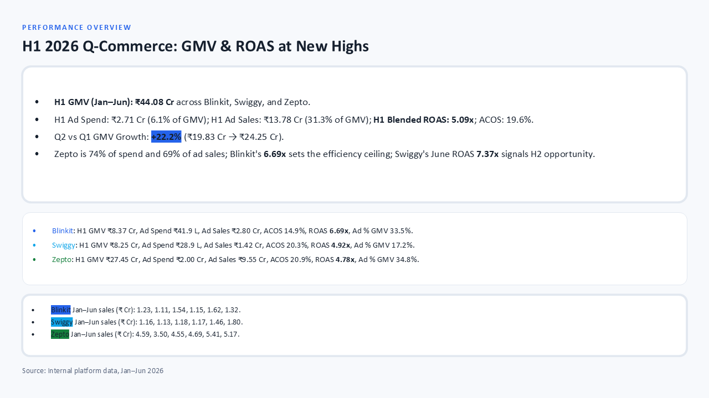
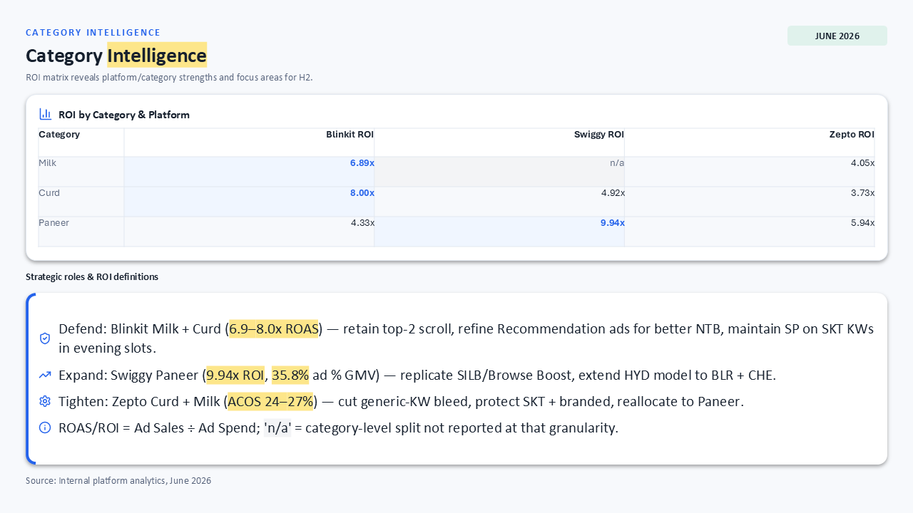
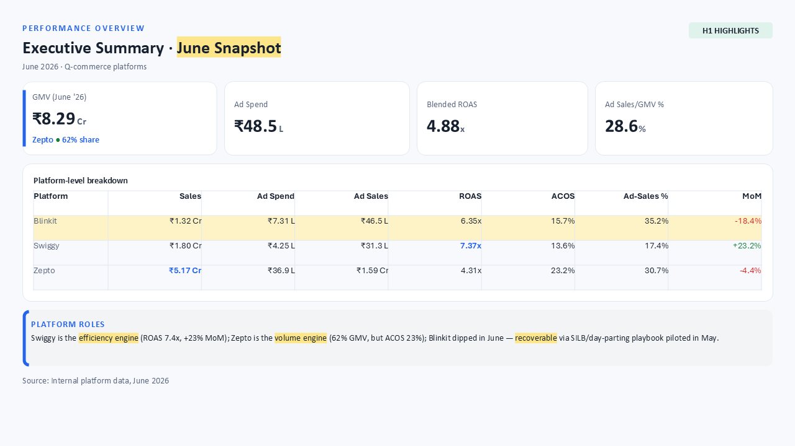
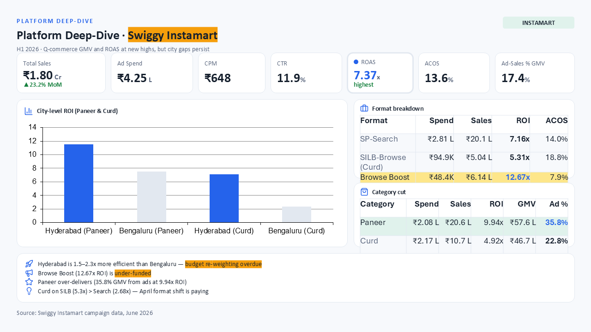
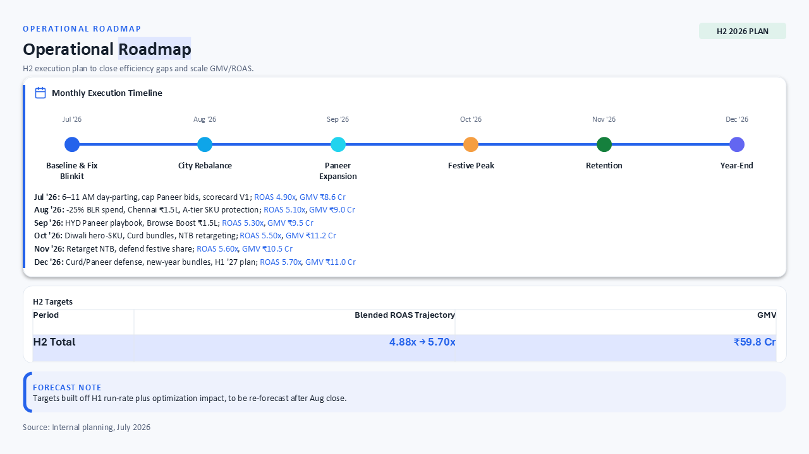
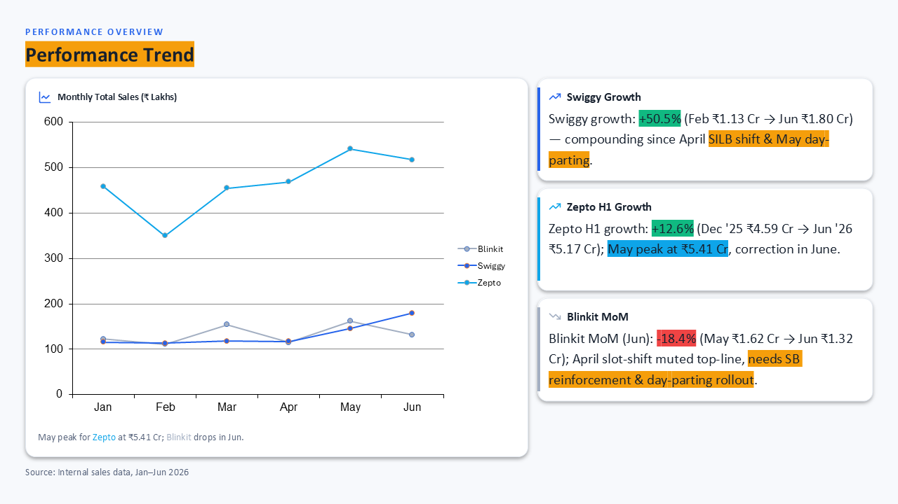
