# Eval `phase-5-tables`

2026-09-24T12:53:49 · commit `566fc64` · models.yaml `919e01fa` · 1 runs, 14 slides

| metric | value |
|---|---|
| runs_passed | 1 |
| runs_errored | 0 |
| slide_count_off | 0 |
| compiled_pct | 100.0 |
| first_pass_pct | 85.7 |
| mean_retries | 0.21 |
| cards | 73 |
| mean_fill | 0.947 |
| low_fill_pct | 2.7 |
| word_breaks_per_slide | 0.21 |
| text_overflows_per_slide | 0.0 |
| table_spill_slides | 3 |
| table_spill_px | 326 |
| invented_numbers | 5 |
| auto_fixes_per_slide | 1.0 |
| layout_issues_per_slide | 0.07 |
| fit_grow_changes_per_slide | 1.29 |
| tokens_in | 329965 |
| tokens_out | 51259 |
| cost_usd | 1.07 |
| elapsed_s | 354.3 |

Fill = card content height ÷ inner height (1.0 = no dead space); low fill < 0.7. Word breaks = text boxes narrower than their longest word; text overflows = text needing 2+ lines more than its box; table spill = table rows past their frame (slides, px); invented numbers = numbers on slides that are not in the brief; slide_count_off = runs whose slide count differs from the case target.

## Cases

| case | run | pass | slides (target) | first-pass | retries | mean fill | low-fill cards | word breaks | overflows | invented numbers | layout issues | golden match |
|---|---|---|---|---|---|---|---|---|---|---|---|---|
| gj-h1-regen | 1 | PASS | 14 (14) | 12/14 | 3 | 0.95 | 2 | 3 | 0 | 5 | 1 | 0.495 |

## Auto-fix codes (first attempt)

- `AMPERSAND_ESCAPED`: 6
- `EMPTY_TEXT_REMOVED`: 3
- `ATTR_CONFLICT_FIXED`: 2
- `UNKNOWN_ICON_REMOVED`: 2
- `EMPTY_CELL_FILLED`: 1

## Blocking codes during retries

- `INVALID_VALUE`: 3

## Blocking messages (first 3 per slide)

- `INVALID_VALUE: addTextBox: width must be a finite positive EMU value`: 1
- `INVALID_VALUE: addTextBox: height must be a finite positive EMU value`: 1

## Layout-audit codes (final attempt)

- `COL_WIDTH_SUM`: 1

## Card patterns

- `text_card`: 29
- `kpi_tile`: 28
- `table_card`: 8
- `chart_card`: 6
- `dark_panel`: 2

## Planner component kinds

- `title`: 13
- `table`: 9
- `kpi_row`: 8
- `bullet_list`: 8
- `narrative`: 7
- `chart`: 5
- `caption`: 3
- `timeline`: 2

## Lowest-fill slides

- gj-h1-regen run 1 slide 0: min fill 0.635
- gj-h1-regen run 1 slide 9: min fill 0.641
- gj-h1-regen run 1 slide 4: min fill 0.736
- gj-h1-regen run 1 slide 7: min fill 0.779
- gj-h1-regen run 1 slide 3: min fill 0.78
- gj-h1-regen run 1 slide 8: min fill 0.807
- gj-h1-regen run 1 slide 12: min fill 0.809
- gj-h1-regen run 1 slide 13: min fill 0.818
- gj-h1-regen run 1 slide 1: min fill 0.873
- gj-h1-regen run 1 slide 11: min fill 0.895

## Review renders

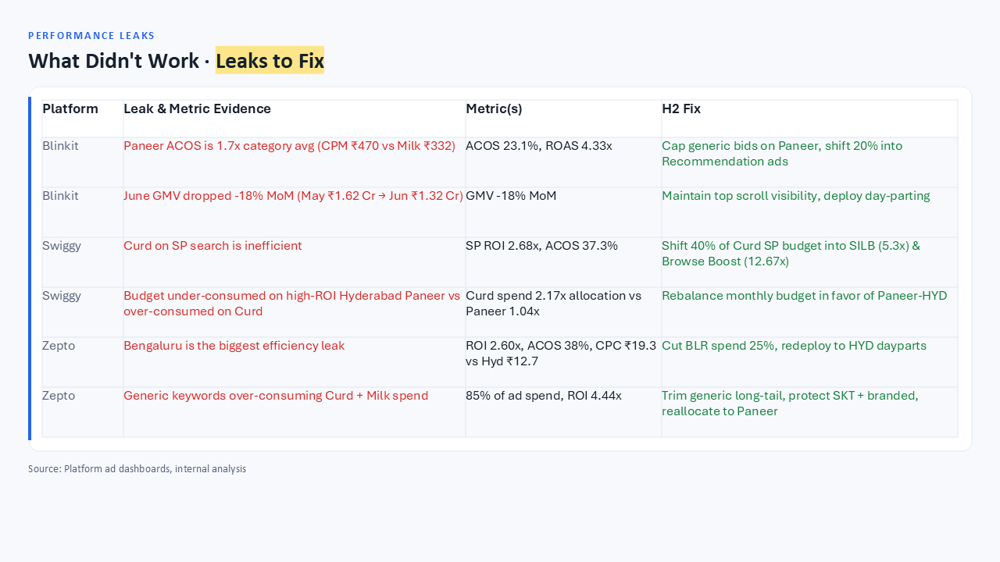
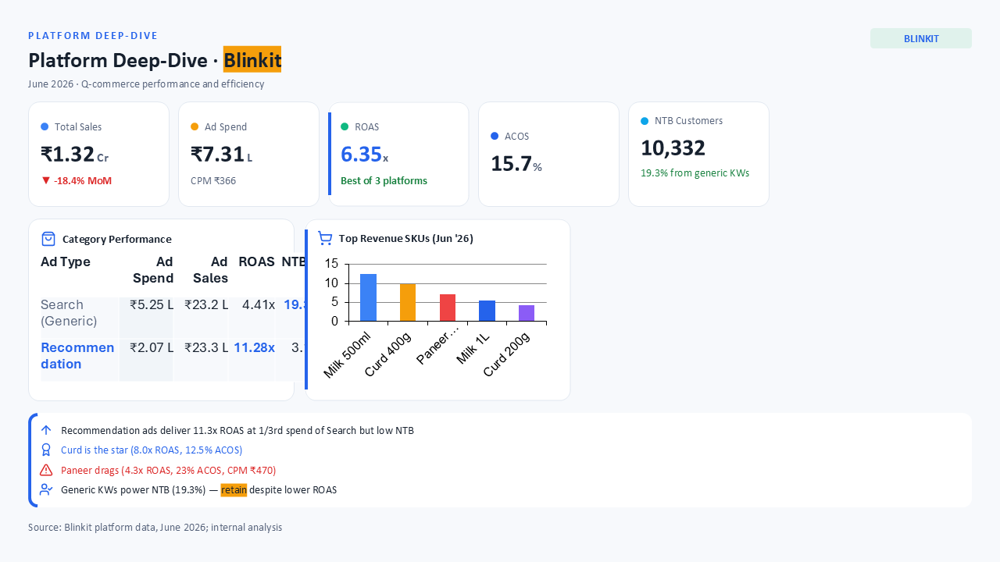
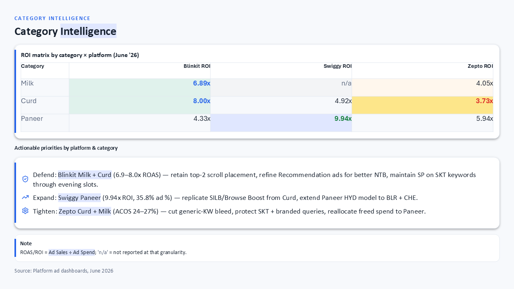
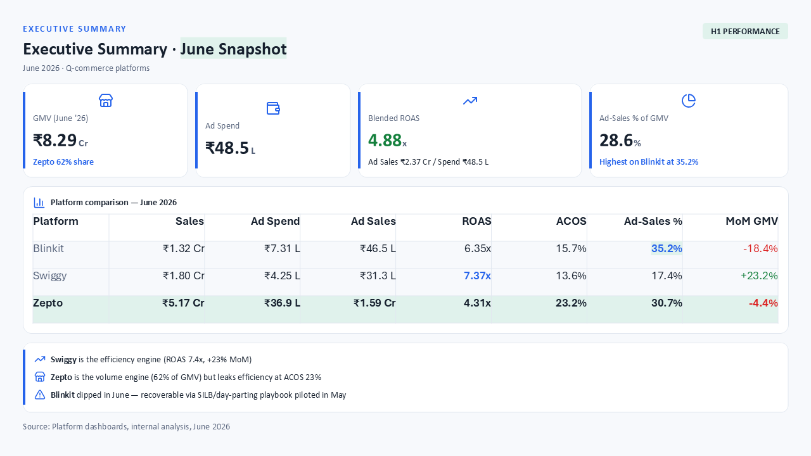
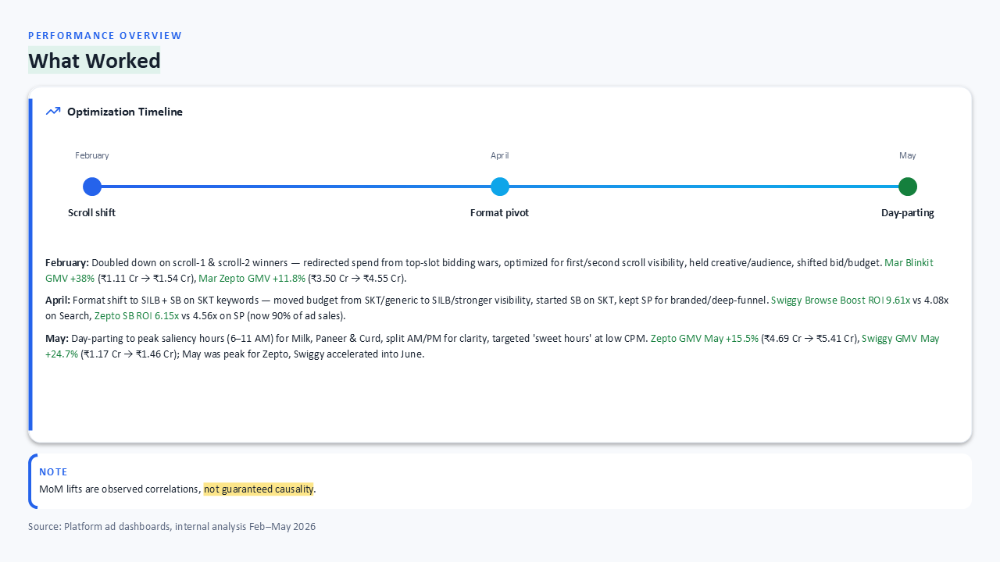
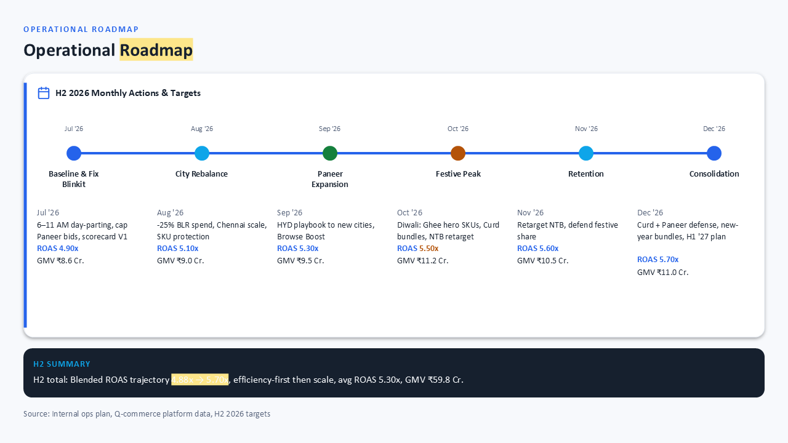
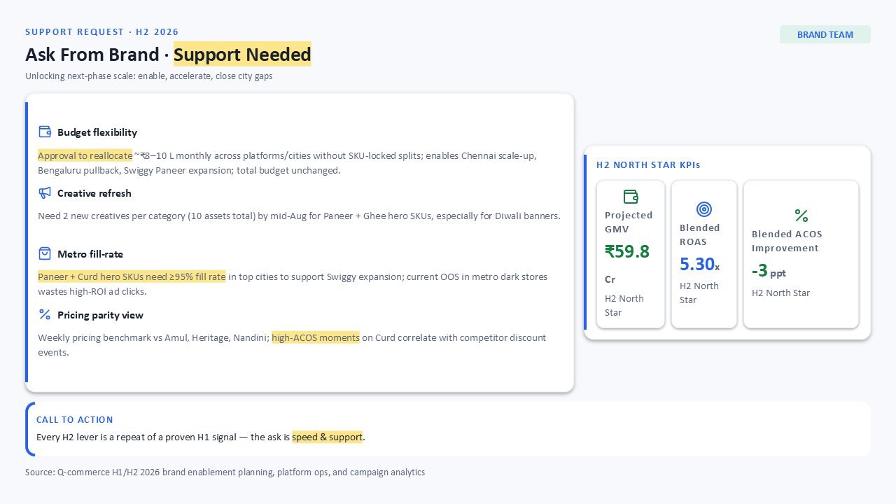
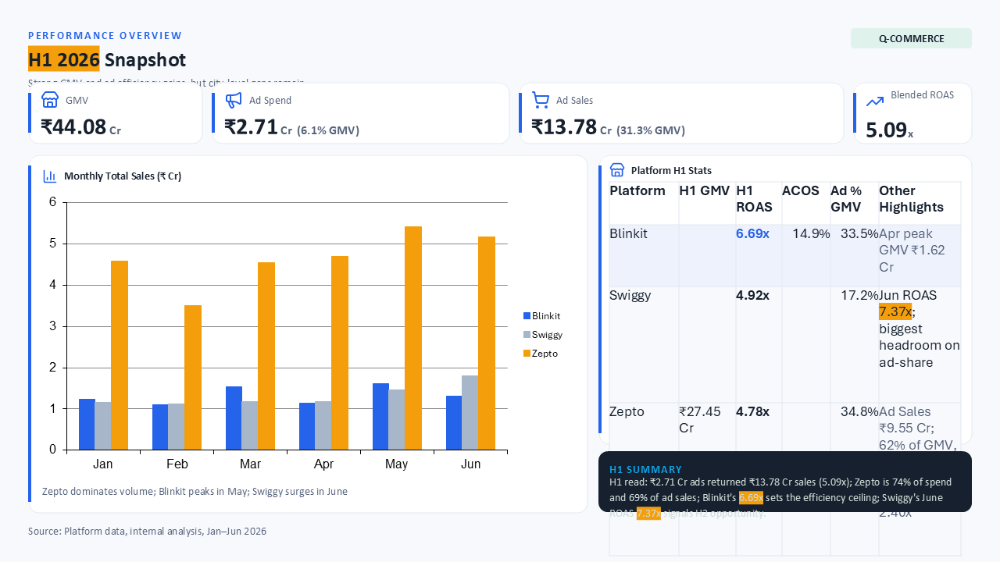
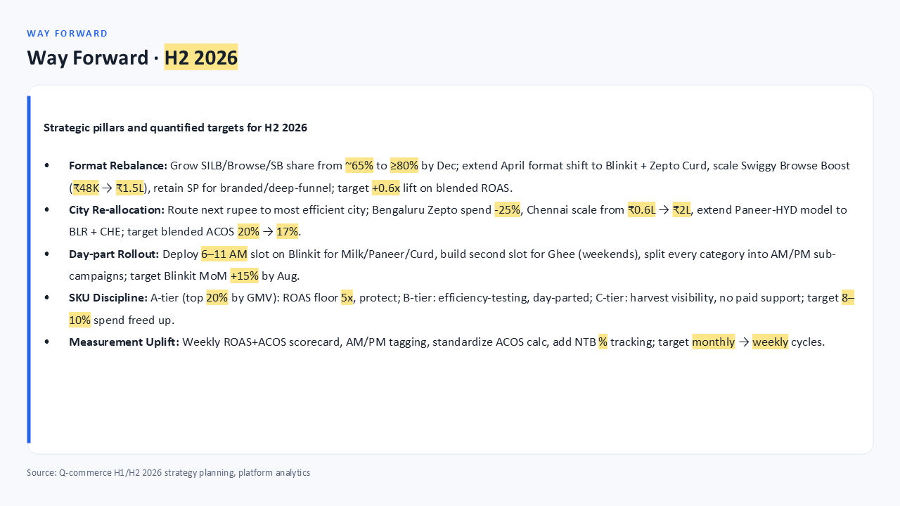
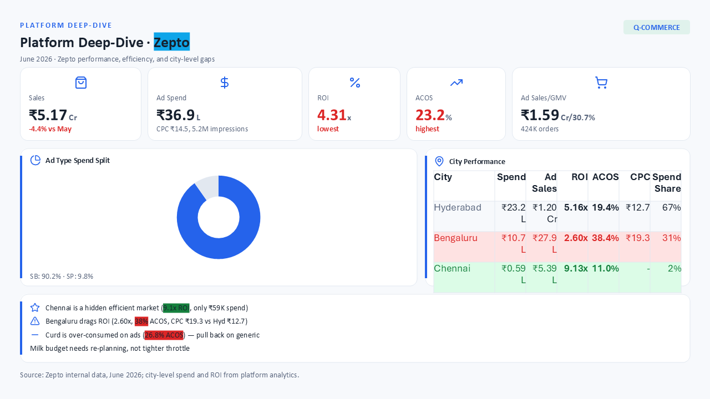
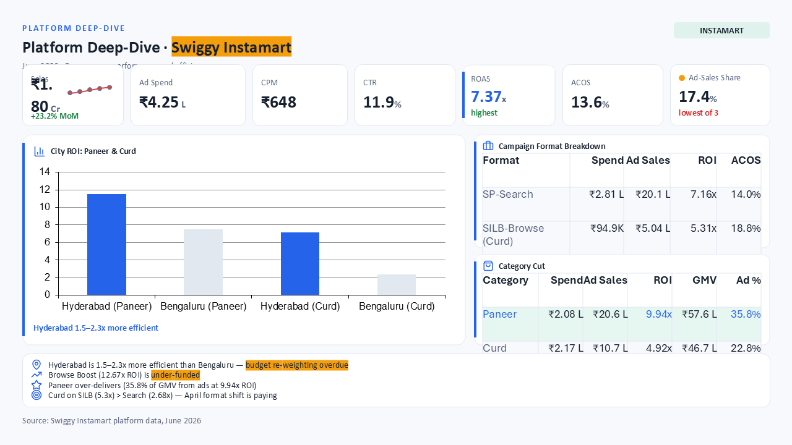
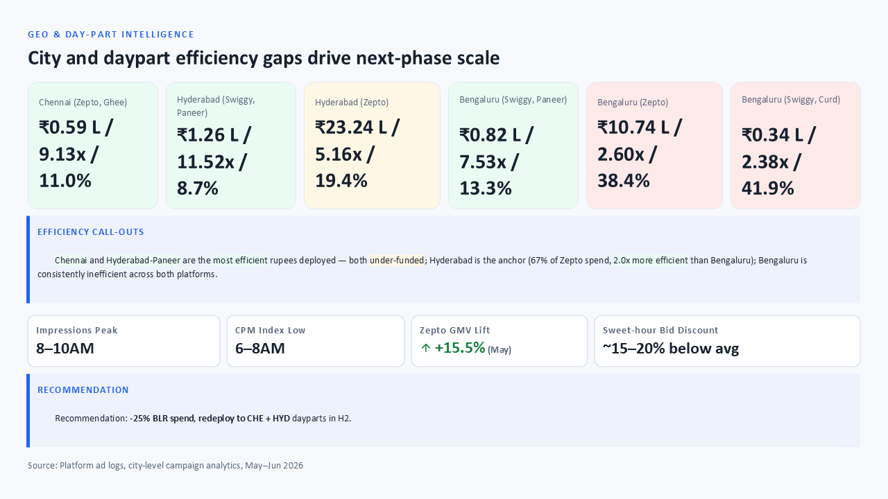
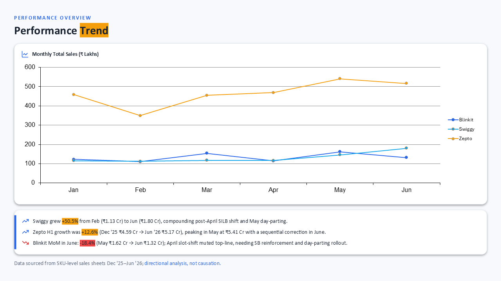
