# Eval `step0`

2026-10-06T22:00:43 · commit `3caf03e` · models.yaml `2518d873` · 6 runs, 37 slides

| metric | value |
|---|---|
| runs_passed | 6 |
| runs_errored | 0 |
| slide_count_off | 0 |
| compiled_pct | 100.0 |
| first_pass_pct | 94.6 |
| mean_retries | 0.05 |
| cards | 156 |
| mean_fill | 0.831 |
| low_fill_pct | 20.5 |
| word_breaks_per_slide | 0.16 |
| text_overflows_per_slide | 0.0 |
| table_spill_slides | 0 |
| table_spill_px | 0 |
| tables_overfull_slides | 0 |
| empty_cells | 0 |
| invented_numbers | 0 |
| auto_fixes_per_slide | 1.03 |
| layout_issues_per_slide | 0.73 |
| fit_grow_changes_per_slide | 2.86 |
| tokens_in | 967699 |
| tokens_out | 243157 |
| cost_usd | 1.7357 |
| elapsed_s | 2457.8 |

Fill = card content height ÷ inner height (1.0 = no dead space); low fill < 0.7. Word breaks = text boxes narrower than their longest word; text overflows = text needing 2+ lines more than its box; table spill = table rows past their frame (slides, px); tables over-full = slides where fit-grow could not fit a table (the slide holds more than 720 px); empty cells = blank table cells (dropped data); invented numbers = numbers on slides that are not in the brief; slide_count_off = runs whose slide count differs from the case target.

## Cases

| case | run | pass | slides (target) | first-pass | retries | mean fill | low-fill cards | word breaks | overflows | invented numbers | layout issues | golden match |
|---|---|---|---|---|---|---|---|---|---|---|---|---|
| deck-qbr-data | 1 | PASS | 5 (5) | 4/5 | 1 | 0.74 | 4 | 0 | 0 | 0 | 2 | - |
| deck-product-launch-data | 1 | PASS | 6 (6) | 6/6 | 0 | 0.52 | 11 | 1 | 0 | 0 | 0 | - |
| gate-deck-agency-takeover | 1 | PASS | 6 (6) | 6/6 | 0 | 0.86 | 7 | 0 | 0 | 0 | 6 | - |
| gate-deck-xtsy-qcomm | 1 | PASS | 8 (8) | 7/8 | 1 | 0.91 | 1 | 5 | 0 | 0 | 13 | - |
| gate-deck-all-nodes-dense | 1 | PASS | 6 (6) | 6/6 | 0 | 0.9 | 0 | 0 | 0 | 0 | 2 | - |
| gate-deck-cheffin-full | 1 | PASS | 6 (6) | 6/6 | 0 | 0.77 | 9 | 0 | 0 | 0 | 4 | - |

## Auto-fix codes (first attempt)

- `TEXT_WHITESPACE_TRIMMED`: 12
- `ATTR_CONFLICT_FIXED`: 10
- `GROW_ROWS_ADDED`: 6
- `ZERO_SPACING`: 5
- `AMPERSAND_ESCAPED`: 4
- `UNKNOWN_ICON_REMOVED`: 1

## Blocking codes during retries

- `INVALID_VALUE`: 4
- `PARSE_ERROR`: 1

## Blocking messages (first 3 per slide)

- `PARSE_ERROR: <Shape>: Cannot parse JSON value: "2563EB"`: 1
- `INVALID_VALUE: <Shape>: Invalid value for attribute "shapeType". Expected: "accentBorderCallout1", "accentBorderCallout2", "accentBorderCallout3", "accentCallout1", "accentCallout2", "accentCallout3", "actionButtonB`: 1

## Layout-audit codes (final attempt)

- `LOW_CONTRAST`: 14
- `DEEP_NESTING`: 12
- `COL_WIDTH_SUM`: 1

## Card patterns

- `text_card`: 95
- `dark_panel`: 26
- `kpi_tile`: 24
- `table_card`: 7
- `chart_card`: 4

## Planner component kinds

- `title`: 37
- `narrative`: 19
- `card_grid`: 16
- `bullet_list`: 12
- `caption`: 10
- `kpi_row`: 8
- `table`: 7
- `chart`: 4
- `timeline`: 3
- `process_arrow`: 2
- `layer`: 2
- `flow`: 2
- `pyramid`: 1
- `matrix`: 1
- `tree`: 1

## Lowest-fill slides

- deck-product-launch-data run 1 slide 5: min fill 0.314
- gate-deck-agency-takeover run 1 slide 2: min fill 0.323
- deck-qbr-data run 1 slide 4: min fill 0.331
- deck-product-launch-data run 1 slide 4: min fill 0.361
- gate-deck-cheffin-full run 1 slide 2: min fill 0.366
- deck-product-launch-data run 1 slide 3: min fill 0.435
- deck-product-launch-data run 1 slide 2: min fill 0.552
- deck-qbr-data run 1 slide 3: min fill 0.553
- gate-deck-cheffin-full run 1 slide 1: min fill 0.554
- gate-deck-cheffin-full run 1 slide 3: min fill 0.56

## Review renders

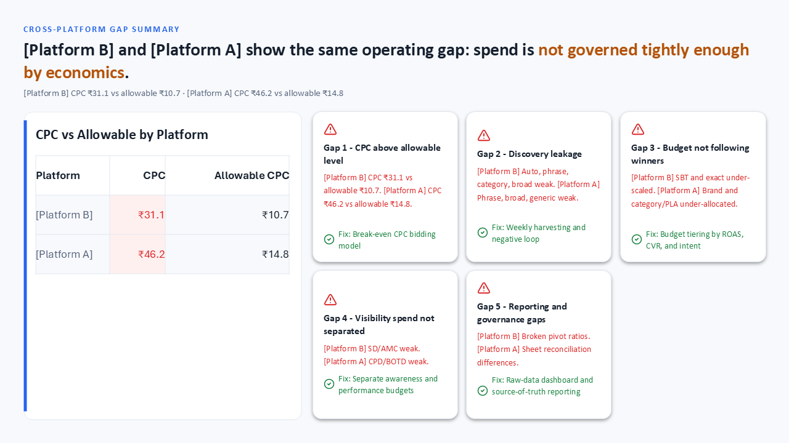
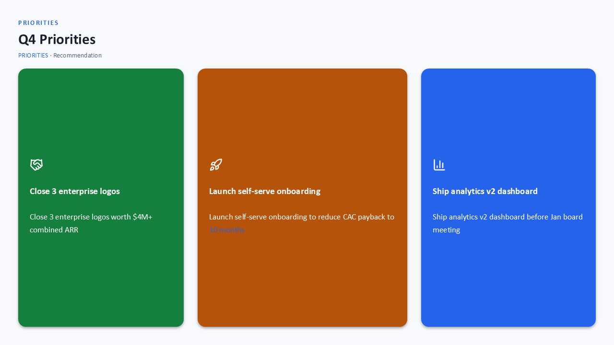
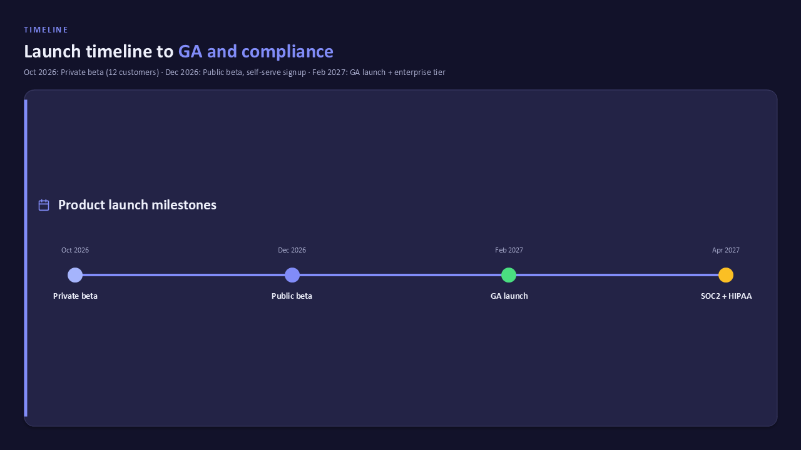
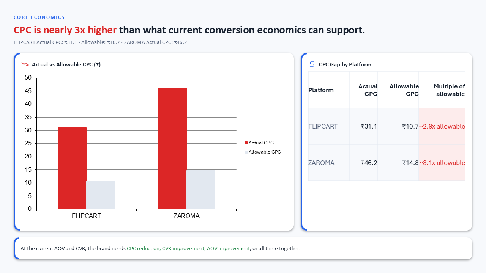
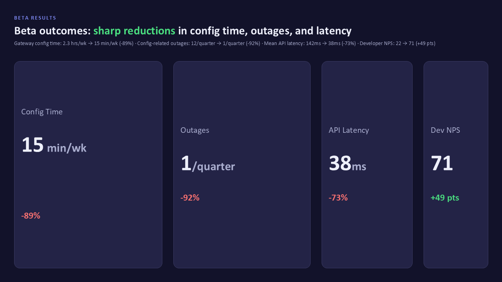
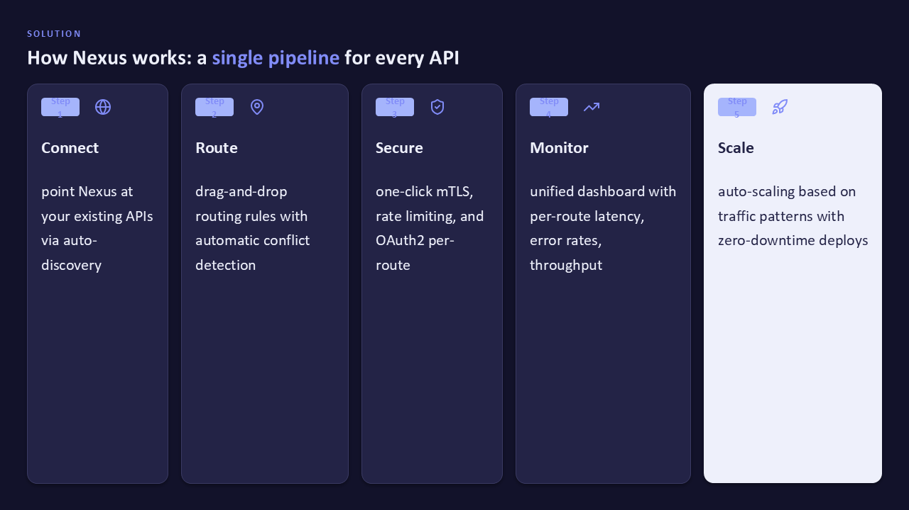
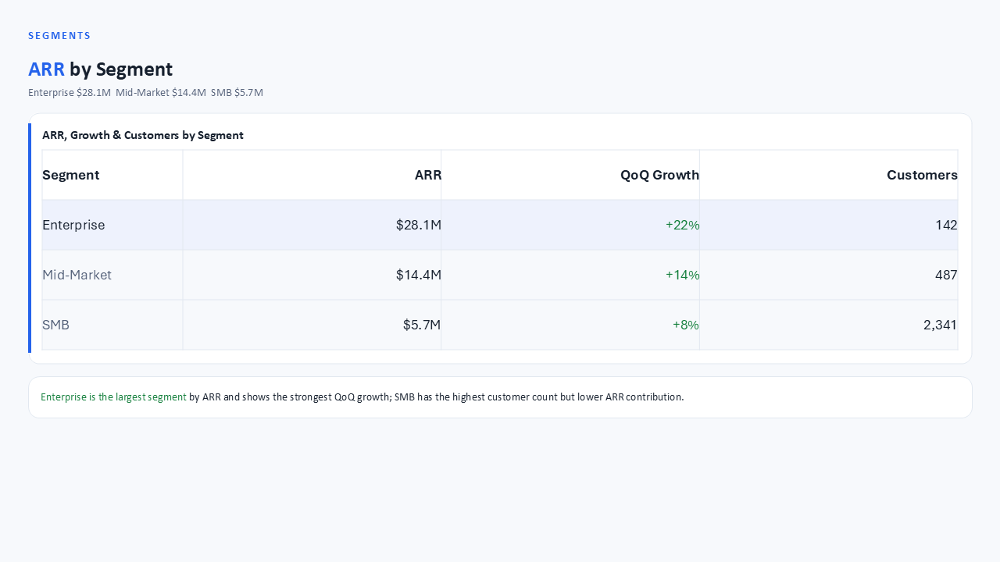
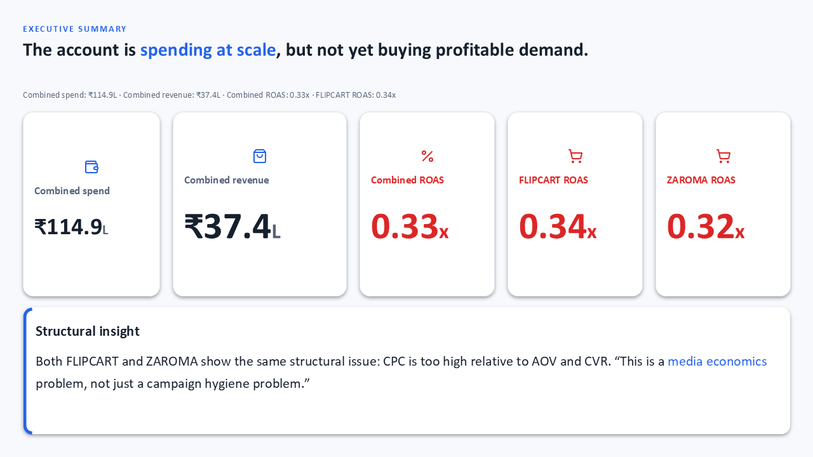
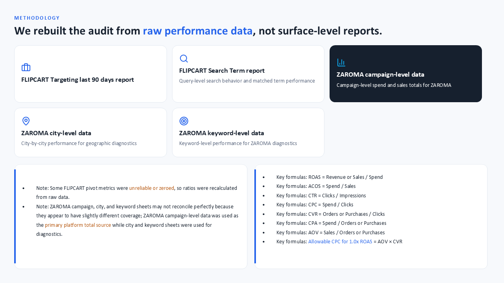
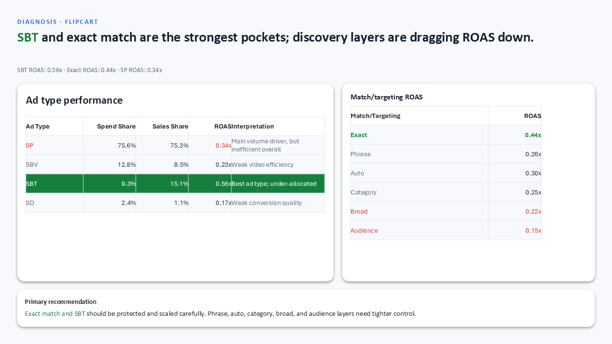
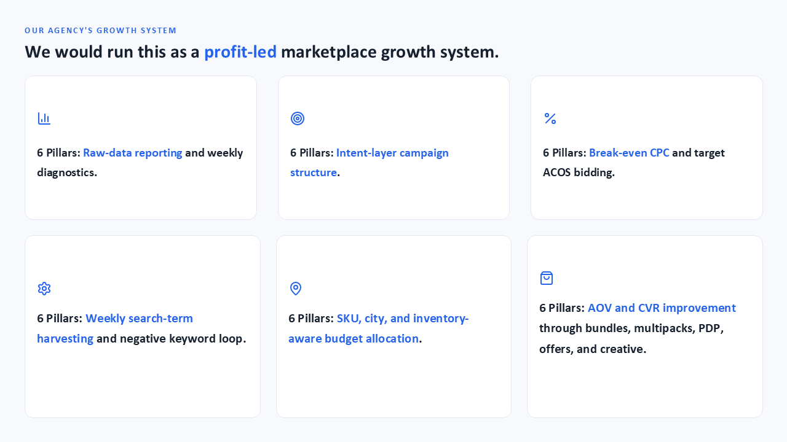
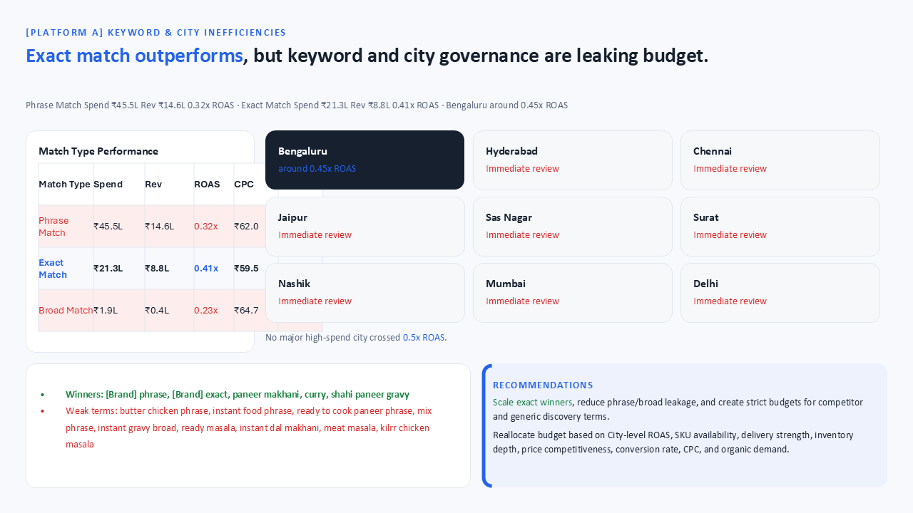
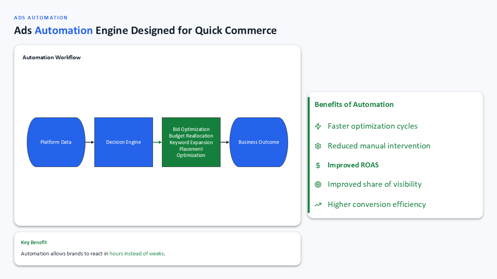
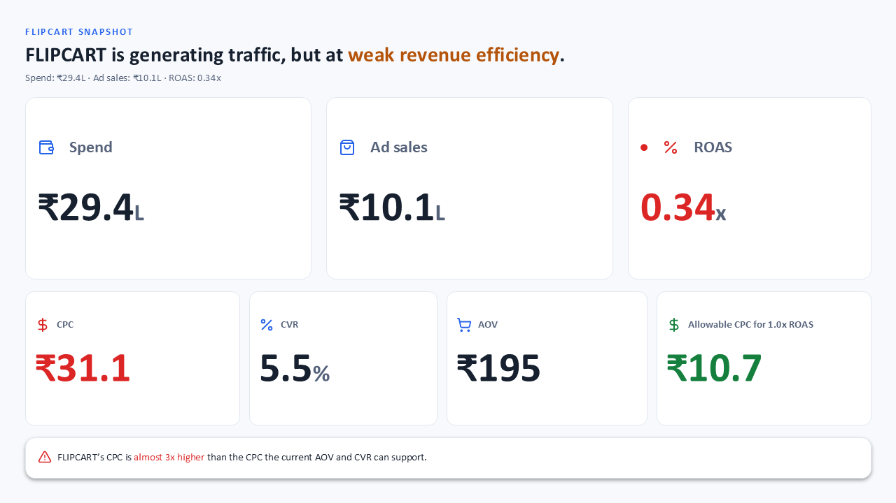
