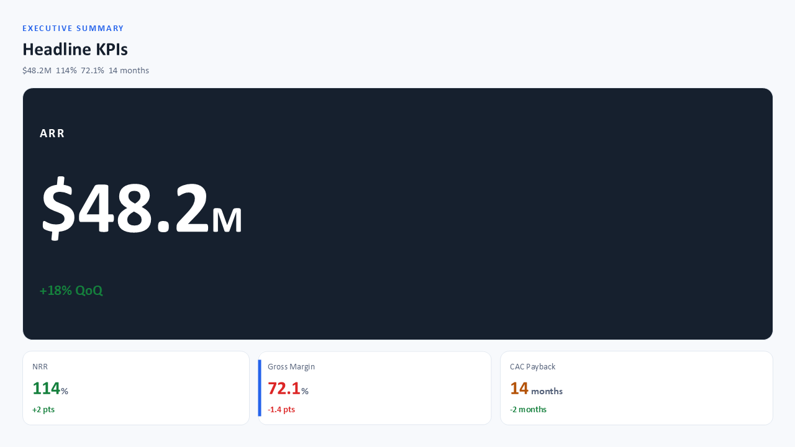
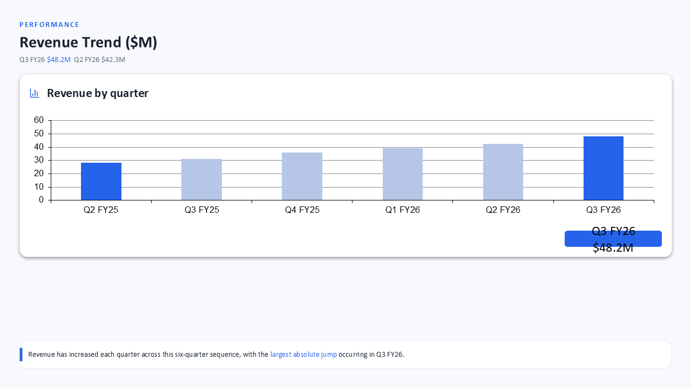
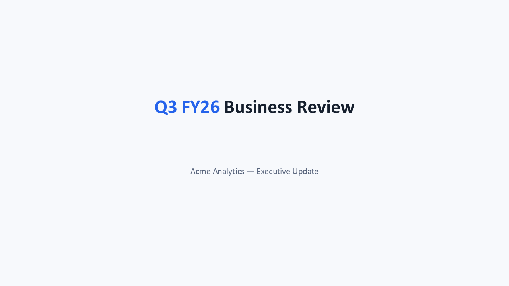

# Eval `step0`

2026-10-06T20:29:06 · commit `9191296` · models.yaml `2518d873` · 1 runs, 5 slides

| metric | value |
|---|---|
| runs_passed | 1 |
| runs_errored | 0 |
| slide_count_off | 0 |
| compiled_pct | 100.0 |
| first_pass_pct | 80.0 |
| mean_retries | 0.2 |
| cards | 11 |
| mean_fill | 0.735 |
| low_fill_pct | 36.4 |
| word_breaks_per_slide | 0.0 |
| text_overflows_per_slide | 0.0 |
| table_spill_slides | 0 |
| table_spill_px | 0 |
| tables_overfull_slides | 0 |
| empty_cells | 0 |
| invented_numbers | 0 |
| auto_fixes_per_slide | 0.8 |
| layout_issues_per_slide | 0.4 |
| fit_grow_changes_per_slide | 2.0 |
| tokens_in | 130640 |
| tokens_out | 24950 |
| cost_usd | 0.2036 |
| elapsed_s | 254.1 |

Fill = card content height ÷ inner height (1.0 = no dead space); low fill < 0.7. Word breaks = text boxes narrower than their longest word; text overflows = text needing 2+ lines more than its box; table spill = table rows past their frame (slides, px); tables over-full = slides where fit-grow could not fit a table (the slide holds more than 720 px); empty cells = blank table cells (dropped data); invented numbers = numbers on slides that are not in the brief; slide_count_off = runs whose slide count differs from the case target.

## Cases

| case | run | pass | slides (target) | first-pass | retries | mean fill | low-fill cards | word breaks | overflows | invented numbers | layout issues | golden match |
|---|---|---|---|---|---|---|---|---|---|---|---|---|
| deck-qbr-data | 1 | PASS | 5 (5) | 4/5 | 1 | 0.74 | 4 | 0 | 0 | 0 | 2 | - |

## Auto-fix codes (first attempt)

- `TEXT_WHITESPACE_TRIMMED`: 3
- `ATTR_CONFLICT_FIXED`: 1

## Blocking codes during retries

- `PARSE_ERROR`: 1

## Blocking messages (first 3 per slide)

- `PARSE_ERROR: <Shape>: Cannot parse JSON value: "2563EB"`: 1

## Layout-audit codes (final attempt)

- `LOW_CONTRAST`: 2

## Card patterns

- `text_card`: 4
- `kpi_tile`: 3
- `dark_panel`: 2
- `chart_card`: 1
- `table_card`: 1

## Planner component kinds

- `title`: 5
- `kpi_row`: 2
- `narrative`: 2
- `chart`: 1
- `table`: 1
- `caption`: 1
- `card_grid`: 1

## Lowest-fill slides

- deck-qbr-data run 1 slide 4: min fill 0.331
- deck-qbr-data run 1 slide 3: min fill 0.553
- deck-qbr-data run 1 slide 1: min fill 0.803
- deck-qbr-data run 1 slide 2: min fill 0.901

## Review renders

