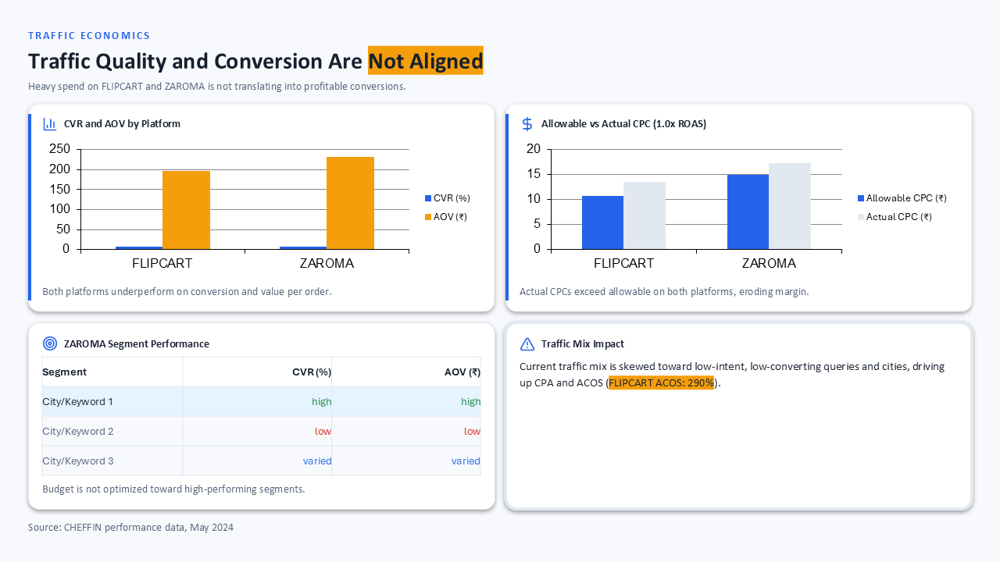
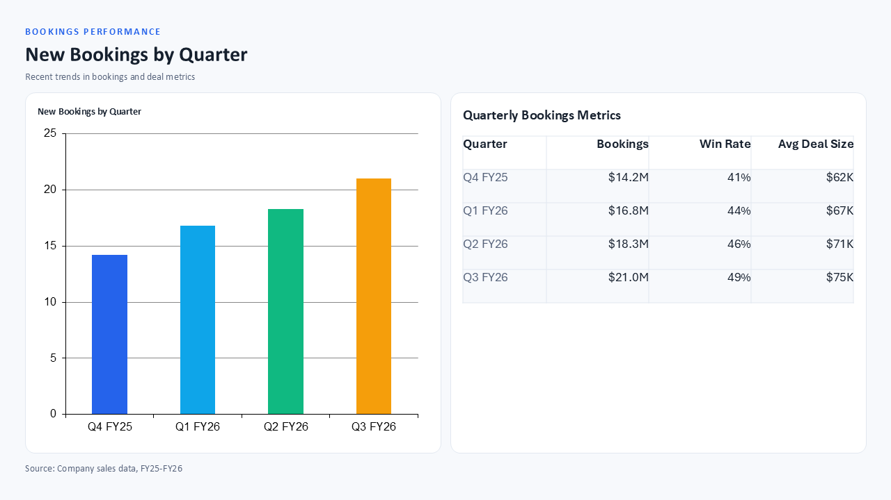
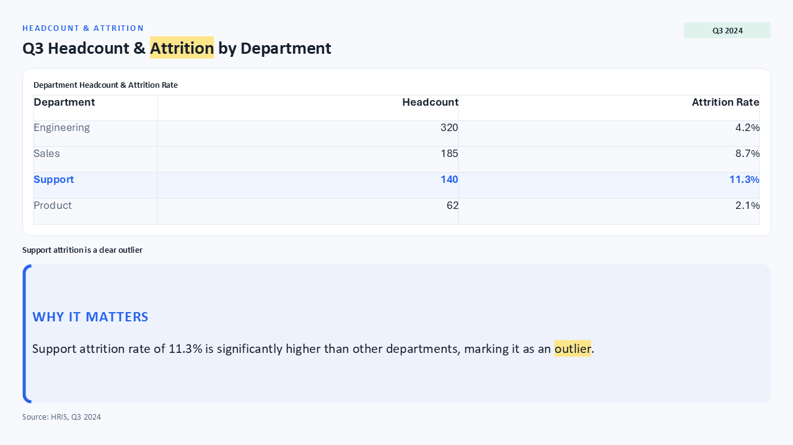
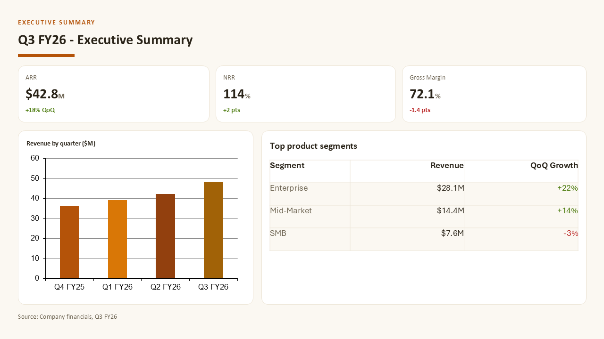
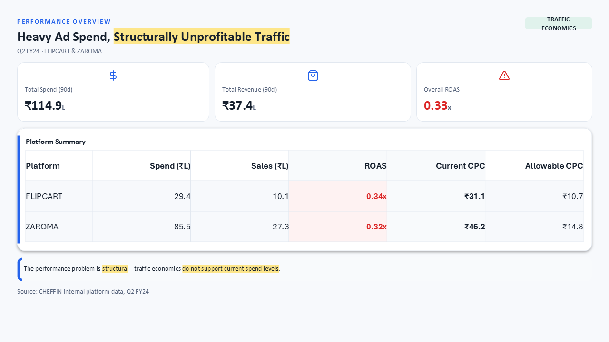

# Eval `tables-check`

2026-09-24T20:51:15 · commit `9b668e1` · models.yaml `919e01fa` · 7 runs, 25 slides

| metric | value |
|---|---|
| runs_passed | 7 |
| runs_errored | 0 |
| slide_count_off | 0 |
| compiled_pct | 100.0 |
| first_pass_pct | 96.0 |
| mean_retries | 0.04 |
| cards | 112 |
| mean_fill | 0.883 |
| low_fill_pct | 16.1 |
| word_breaks_per_slide | 0.04 |
| text_overflows_per_slide | 0.12 |
| table_spill_slides | 4 |
| table_spill_px | 109 |
| tables_overfull_slides | 5 |
| empty_cells | 0 |
| invented_numbers | 88 |
| auto_fixes_per_slide | 0.28 |
| layout_issues_per_slide | 0.08 |
| fit_grow_changes_per_slide | 2.08 |
| tokens_in | 508700 |
| tokens_out | 68959 |
| cost_usd | 1.569 |
| elapsed_s | 243.8 |

Fill = card content height ÷ inner height (1.0 = no dead space); low fill < 0.7. Word breaks = text boxes narrower than their longest word; text overflows = text needing 2+ lines more than its box; table spill = table rows past their frame (slides, px); tables over-full = slides where fit-grow could not fit a table (the slide holds more than 720 px); empty cells = blank table cells (dropped data); invented numbers = numbers on slides that are not in the brief; slide_count_off = runs whose slide count differs from the case target.

## Cases

| case | run | pass | slides (target) | first-pass | retries | mean fill | low-fill cards | word breaks | overflows | invented numbers | layout issues | golden match |
|---|---|---|---|---|---|---|---|---|---|---|---|---|
| gj-h1-regen | 1 | PASS | 14 (14) | 13/14 | 1 | 0.9 | 9 | 1 | 3 | 2 | 2 | 0.547 |
| single-table | 1 | PASS | 1 (1) | 1/1 | 0 | 0.67 | 1 | 0 | 0 | 16 | 0 | - |
| chart-and-table | 1 | PASS | 1 (1) | 1/1 | 0 | 0.71 | 1 | 0 | 0 | 16 | 0 | - |
| eval-table-vs-kpi-disambiguation | 1 | PASS | 1 (1) | 1/1 | 0 | 0.65 | 1 | 0 | 0 | 2 | 0 | - |
| mixed-executive-slide | 1 | PASS | 1 (1) | 1/1 | 0 | 0.9 | 1 | 0 | 0 | 14 | 0 | - |
| maximal-density | 1 | PASS | 1 (1) | 1/1 | 0 | 0.96 | 0 | 0 | 0 | 29 | 0 | - |
| gate-deck-cheffin-audit | 1 | PASS | 6 (6) | 6/6 | 0 | 0.85 | 5 | 0 | 0 | 9 | 0 | - |

## Auto-fix codes (first attempt)

- `AMPERSAND_ESCAPED`: 3
- `ATTR_CONFLICT_FIXED`: 2
- `BORDER_ACCENT_FIX`: 1
- `ZERO_SPACING`: 1

## Blocking codes during retries

- `UNKNOWN_ATTRIBUTE`: 6

## Blocking messages (first 3 per slide)

- `UNKNOWN_ATTRIBUTE: <Tr>.<Td>: Unknown attribute "borderLeft"`: 1

## Layout-audit codes (final attempt)

- `COL_WIDTH_SUM`: 1
- `XML_PARSE_ERROR`: 1

## Card patterns

- `text_card`: 33
- `kpi_tile`: 33
- `table_card`: 23
- `chart_card`: 14
- `dark_panel`: 9

## Planner component kinds

- `title`: 21
- `table`: 18
- `bullet_list`: 13
- `narrative`: 12
- `kpi_row`: 8
- `chart`: 8
- `timeline`: 2
- `process_arrow`: 1

## Lowest-fill slides

- gj-h1-regen run 1 slide 12: min fill 0.245
- gate-deck-cheffin-audit run 1 slide 3: min fill 0.35
- gate-deck-cheffin-audit run 1 slide 5: min fill 0.424
- chart-and-table run 1 slide 0: min fill 0.425
- gj-h1-regen run 1 slide 8: min fill 0.459
- eval-table-vs-kpi-disambiguation run 1 slide 0: min fill 0.51
- mixed-executive-slide run 1 slide 0: min fill 0.519
- gate-deck-cheffin-audit run 1 slide 1: min fill 0.565
- gj-h1-regen run 1 slide 2: min fill 0.599
- gj-h1-regen run 1 slide 5: min fill 0.638

## Review renders

